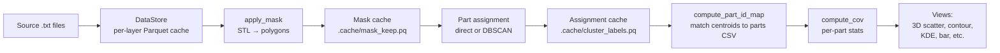

# AMPM Analysis

Analysis pipeline for Renishaw 500S PBF-LB AMPM (Additive Manufacturing Process Monitoring) data.

Each Renishaw 500S build produces hundreds of layers, each containing ~250,000 monitoring rows recording meltpool intensity, plasma intensity, laser back-reflection, and laser power along with the demanded XY position. A full build is ~80M rows. This package loads that data, masks it to the printed parts, assigns points to individual physical parts (via direct nearest-part or DBSCAN clustering), and produces coefficient-of-variation analysis plus interactive plots.

<!-- TODO: add a screenshot of the GUI (Config tab or a plot) and uncomment:

-->

## Quickstart

### GUI (recommended)

```bash
# Clone the repo
git clone https://github.com/Obbaron/ampm-analysis.git
cd ampm-analysis

# Run the setup script
# Windows:
setup.bat
# Linux/macOS:
chmod +x setup.sh && ./setup.sh

# Activate the virtual environment
# Windows:
.venv\Scripts\activate
# Linux/macOS:
source .venv/bin/activate

# Launch the GUI
python launcher.py          # recommended (retries a failed startup); or: python app.py
```

Select a project root directory, review the auto-detected configuration, load data, add derived columns, and plot. See [APP.md](APP.md) for a full walkthrough of the GUI.

### Compiled executable (no Python required)

Download the latest release for the appropriate platform from the [Releases](https://github.com/Obbaron/ampm-analysis/releases) page. Unzip the folder and double-click `ampm-analysis.exe`.

### CLI / scripts

```bash
pip install -e .

# Run an example script with a project root directory
python examples/parametric.py /path/to/root_directory
python examples/view_layers.py /path/to/root_directory
```

The first run takes several minutes as the script converts every source `.txt` packet file to a per-layer Parquet cache, computes the STL-based mask, and runs assignment. Subsequent runs are then faster because everything is cached on disk.

## Pipeline overview



Each stage is independent and cacheable. If you change clustering parameters but not the mask, only the cluster cache invalidates.

The diagram shows the **DBSCAN** path. **Direct** assignment skips the clustering and centroid-matching steps (`cluster_labels.pq`, `compute_part_id_map`) and matches each point to its nearest part directly.

See [docs/PIPELINE.md](docs/PIPELINE.md) for the full step-by-step of how to build a script.

## Project layout

```
ampm-analysis/
├── app.py                      # GUI entry point (PyQt6)
├── launcher.py                 # CLI launcher (startup retry + Ctrl+C handling)
├── pyproject.toml              # Project dependencies
├── setup.bat                   # Windows setup script
├── setup.sh                    # Linux/macOS setup script
├── assets/
│   ├── ampm.ico                # App icon (Windows)
│   └── ampm.icns               # App icon (macOS)
├── ampm/                       # The package
│   ├── config.py               # Reads config.toml
│   ├── setup_build.py          # Autodetects files
│   ├── datastore.py            # Creates Parquet cache
│   ├── masking.py              # Per-layer polygon masks
│   ├── mask_cache.py           # Persistence for masked rows
│   ├── clustering.py           # DBSCAN
│   ├── cluster_cache.py        # Persistence for cluster labels
│   ├── parts.py                # QuantAM CSV parser
│   ├── stats.py                # CoV
│   ├── correction.py           # XY-bias correction polynomial
│   ├── sampling.py             # Downsamplers
│   └── views/                  # Discoverable plot types
│       ├── __init__.py         # discover() auto-loader
│       ├── bar.py
│       ├── contour.py
│       ├── cov_summary.py
│       ├── k_distance.py
│       ├── kde.py
│       ├── layer_viewer.py
│       ├── scatter_2d.py
│       └── scatter_3d.py
├── examples/                   # Runnable example scripts
├── tests/                      # Test suite
└── docs/                       # Documentation
```

## Configuration

Each project root directory contains a `config.toml` with paths and parameters. On first use, `setup_build.py` auto-detects the STL, parts CSV, and layer thickness, and writes a default config. You can edit it manually or review it in the GUI before loading.

See the project root's `config.toml` for all available options.

## Where to next?

- **Just want to see results** → download the compiled `.exe` from Releases
- **Setting up environment** → run `setup.bat` / `setup.sh`, then `python launcher.py`
- **Build has few, large, well-separated parts** → use `direct` assignment method in config
- **Tuning DBSCAN for a new build** → run `python examples/tune_eps.py`, also see [docs/CLUSTERING.md](docs/CLUSTERING.md)
- **Cache misbehaving / want to clear it** → [docs/CACHING.md](docs/CACHING.md)
- **A part isn't being identified correctly** → [docs/PARTS.md](docs/PARTS.md)
- **Want to add a new view** → create a new `.py` file in `ampm/views/` following the contract (NAME, DESCRIPTION, AXES, SETTINGS, run)
- **Different machine or sensor** → [docs/CORRECTION.md](docs/CORRECTION.md)

## Installation

### Online (with internet access)

```bash
pip install -e .
```

To also install the test framework:

```bash
pip install -e ".[dev]"
```

### Offline

If a `wheels/windows/` or `wheels/linux/` folder is present, the setup scripts install from those automatically. Otherwise, to create the wheels on a machine with internet:

```bash
pip download . -d wheels/windows/   # run on Windows
pip download . -d wheels/linux/     # run on Linux
```

Requires Python 3.11 or newer.

## License

This project is for internal use only. See the [LICENSE](LICENSE) file for details.

## Running tests

```bash
pytest                          # Full suite
pytest tests/test_<module>.py   # Single module
```

Requires `pip install -e ".[dev]"` to get pytest.

## Limitations

- The default polynomial in `correction.py` is calibrated for the **MAIN machine's MeltVIEW melt pool (mean) signal only**. Pass your own `power_matrix` and `coefficients` for other sensors or machines.
- DBSCAN tuning is build-dependent. The defaults are validated for the JR299 Sterling parametric build (20 parts, 5 mm minimum spacing). For different geometries you may need to retune `EPS_XY` — see [docs/CLUSTERING.md](docs/CLUSTERING.md).
- Windows paths containing `[` or `]` characters require explicit handling because Polars treats them as glob metacharacters. The package handles this internally.