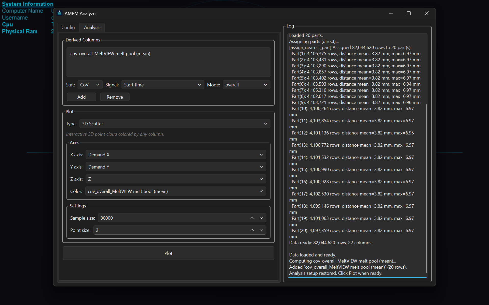
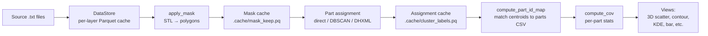

# AMPM Analysis

Analysis pipeline and desktop app for Renishaw 500S PBF-LB AMPM data.

Each build produces hundreds of layers, each containing ~250,000 monitoring rows recording meltpool intensity, plasma intensity, laser back-reflection, and laser power along with the demanded XY position — tens to hundreds of millions of rows per build. This package loads that data, optionally masks it to the printed parts using the build STL, assigns points to individual physical parts (by **direct** nearest-part, **DBSCAN** clustering, or **DHXML** bounding boxes), and produces coefficient-of-variation analysis plus interactive plots.



## Quickstart

### GUI (recommended)

```bash
# Clone the repo
git clone https://github.com/Obbaron/ampm-analysis.git
cd ampm-analysis

# Create the environment
# Windows:
setup.bat
# Linux/macOS:
chmod +x setup.sh && ./setup.sh
# (or, if you use make: `make setup`)

# Activate the virtual environment
# Windows:
.venv\Scripts\activate
# Linux/macOS:
source .venv/bin/activate

# Launch the GUI
python app.py        # or: make run
```

Select a project root directory, review the auto-detected configuration, choose an assignment method, load data, add derived columns, and plot. See [docs/APP.md](docs/APP.md) for a full walkthrough of the GUI.

The window remembers its size, position, and layout between launches.

### Compiled executable (no Python required)

Download the latest release from the [Releases](https://github.com/Obbaron/ampm-analysis/releases) page for the appropriate platform.

### CLI / scripts

```bash
pip install -e .

# Run an example script with a project root directory
python examples/parametric.py /path/to/root_directory
python examples/view_layers.py /path/to/root_directory
```

The first run takes several minutes as the script converts every source `.txt` packet file to a per-layer Parquet cache, computes the STL-based mask, and runs assignment. Subsequent runs reuse the on-disk caches and are much faster.

## Development (make)

A `makefile` wraps the common workflows. It guards that the interpreter is Python 3.11.x / 64-bit (matching the offline deployment target) before creating environments or downloading wheels.

```bash
make setup     # create .venv (editable, online) and install dependencies
make run       # launch the GUI
make test      # run the test suite
make build     # build the standalone executable (PyInstaller); pass VERSION=1.3.0
make offline   # install from the bundled wheels (air-gapped), non-editable
make wheels    # (Windows) regenerate the offline wheel set
make clean     # remove .venv, build artifacts, and profile output
make help      # list all targets
```

### Profiling

Scalene-based targets profile the hot paths and open an HTML report:

```bash
make profile-direct    # profile the direct (nearest-part) assignment path
make profile-cluster   # profile the DBSCAN clustering path
make profile-dhxml     # profile the DHXML bounding-box path
make profile-compare   # compare the assignment strategies head-to-head
make profile DRIVER=profile_direct.py OUT=direct.json   # profile any driver
make profile-view      # open the last profile
```

Set `AMPM_MEMPROF=1` to enable the optional per-stage memory profiler (`ampm/memprof.py`) during a normal run.

## Pipeline overview



Each stage is independent and cacheable. If you change clustering parameters but not the mask, only the cluster cache invalidates.

The diagram shows the **DBSCAN** path. The other two assignment methods are shorter:

- **Direct** matches each point to its nearest part position from the parts CSV, skipping the clustering and centroid-matching steps (`cluster_labels.pq`, `compute_part_id_map`).
- **DHXML** assigns each point to the part whose 3D bounding box (read from the Renishaw *BuildStarted* `.dhxml` file the machine writes alongside the data) contains it. It needs no parts CSV and no clustering — useful for tightly-packed builds where nearest-part assignment bleeds across boundaries. Points outside every box are labelled `noise` so another method can catch them.

Masking is optional: with no STL, turn it off and assignment runs on the full plate. A **part filter** lets you drop specific parts (e.g. a colleague's parts sharing the plate) after assignment.

See [docs/PIPELINE.md](docs/PIPELINE.md) for the full step-by-step of how to build a script.

## Project layout

```
ampm-analysis/
├── app.py                      # GUI entry point (PyQt6)
├── makefile                    # setup / run / test / build / profile targets
├── pyproject.toml              # Project metadata and dependencies
├── setup.bat                   # Windows setup script
├── setup.sh                    # Linux/macOS setup script
├── assets/
│   ├── ampm.ico                # App icon (Windows)
│   └── ampm.icns               # App icon (macOS)
├── ampm/                       # The package
│   ├── config.py               # Reads config.toml
│   ├── setup_build.py          # Autodetects build files, writes config.toml
│   ├── datastore.py            # Per-layer Parquet cache + queries
│   ├── masking.py              # Per-layer polygon masks
│   ├── stl_stream.py           # Streaming STL slicer (preferred path)
│   ├── mask_cache.py           # Persistence for masked rows
│   ├── clustering.py           # DBSCAN
│   ├── cluster_cache.py        # Persistence for cluster labels
│   ├── parts.py                # QuantAM CSV / BuildStarted DHXML parsing
│   ├── stats.py                # CoV
│   ├── correction.py           # XY-bias correction polynomial
│   ├── plotting.py             # Shared plotting helpers
│   ├── sampling.py             # Downsamplers
│   └── views/                  # Discoverable plot types
│       ├── __init__.py         # discover() auto-loader
│       ├── bar.py
│       ├── contour.py
│       ├── cov_summary.py
│       ├── k_distance.py
│       ├── kde.py
│       ├── layer_viewer.py
│       ├── scatter_2d.py
│       ├── scatter_3d.py
│       └── single_layer.py
├── examples/                   # Runnable example scripts
├── tests/                      # Test suite (pytest, one module per source module)
└── docs/                       # Documentation
```

## Configuration

Each project root directory contains a `config.toml` with paths and parameters. On first use, `setup_build.py` autodetects the source data and — when present — the STL and QuantAM parts CSV, then writes a default config.

The STL and parts CSV are **optional**: a build with neither (for example, one using the DHXML method with masking off) still loads. The STL is only needed for masking; the parts CSV only for the direct/DBSCAN methods and for power/speed lookup. When there's no parts CSV to read the layer thickness from, set it in the GUI before loading.

You can edit `config.toml` manually or review every path and parameter in the GUI before loading. Options that can't be completed (e.g. masking with no STL) are disabled there with a tooltip explaining what's missing, and validation runs when you press **Load Data**.

## Where to next?

- **Just want to see results** → download the compiled `.exe` from Releases
- **Setting up environment** → run `setup.bat` / `setup.sh` (or `make setup`), then `python app.py`
- **Build has few, large, well-separated parts** → use the `direct` method
- **Build has many tightly-packed parts** → use the `clustering` method (bounding boxes from the BuildStarted file)
- **Tuning DBSCAN for a new build** → run `python examples/tune_eps.py`, also see [docs/CLUSTERING.md](docs/CLUSTERING.md)
- **Colleague's parts share the plate** → tick them off in the GUI's *Part filter*
- **Cache misbehaving / want to clear it** → [docs/CACHING.md](docs/CACHING.md)
- **A part isn't being identified correctly** → [docs/PARTS.md](docs/PARTS.md)
- **Want to add a new view** → create a new `.py` file in thhe build folder following the contract
(NAME, DESCRIPTION, AXES, SETTINGS, run)
- **Different machine or sensor** → [docs/CORRECTION.md](docs/CORRECTION.md)

## Installation

### Online (with internet access)

```bash
pip install -e .          # or: make setup
```

To also install the test framework:

```bash
pip install -e ".[dev]"
```

### Offline (no internet)

If a `wheels/windows/` or `wheels/linux/` folder is present, the setup scripts (and `make offline`) install from those automatically. To create the wheels on a machine with internet:

```bash
pip download . -d wheels/windows/   # run on Windows
pip download . -d wheels/linux/     # run on Linux
# (or, on the Windows deployment-matching machine: `make wheels`)
```

Requires Python 3.11 or newer (3.11.x / 64-bit to match the bundled offline wheels).

## Running tests

```bash
pytest                          # Full suite (or: make test)
pytest tests/test_<module>.py   # Single module
```

Requires `pip install -e ".[dev]"` to get pytest.

## Limitations

- The default polynomial in `correction.py` is calibrated for the **MAIN machine's MeltVIEW melt pool (mean) signal only**. Pass your own `power_matrix` and `coefficients` for other sensors or machines.
- DBSCAN tuning is build-dependent. The defaults are validated for the JR299 Sterling parametric build (20 parts, 5 mm minimum spacing). For different geometries you may need to retune `EPS_XY` — see [docs/CLUSTERING.md](docs/CLUSTERING.md).
- DHXML assignment depends on the per-part bounding boxes in the BuildStarted file being correct; it can mislabel on complex geometries, in which case the direct or DBSCAN methods are the fallback.

## License

Copyright (c) 2026 Centre for Custom Medical Devices (CMD). All rights reserved.
This software is proprietary and confidential. Unauthorized copying, modification, distribution, or use, via any medium, is strictly prohibited. See the [LICENSE](LICENSE) file for details.