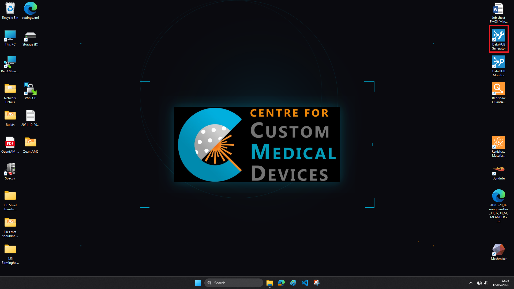
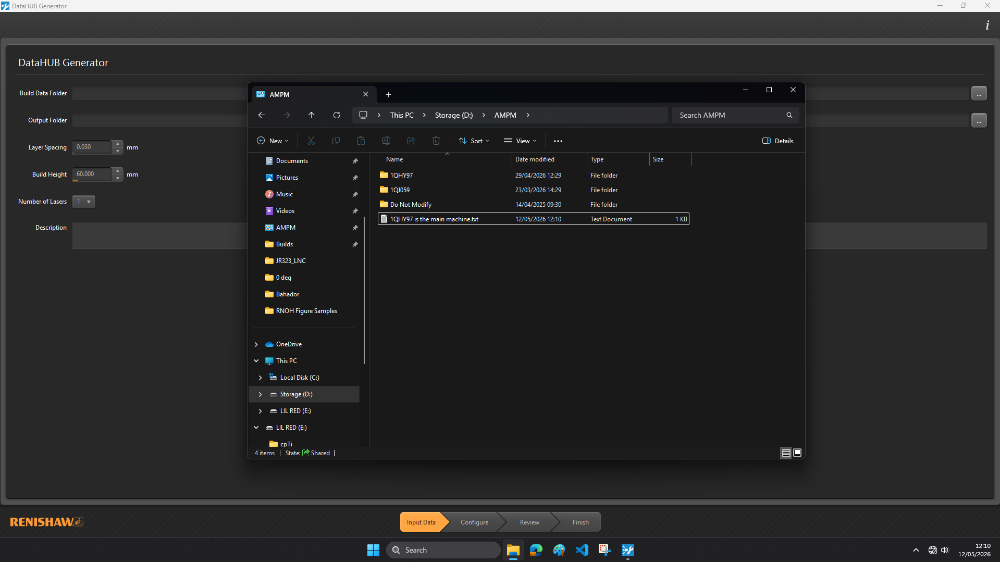
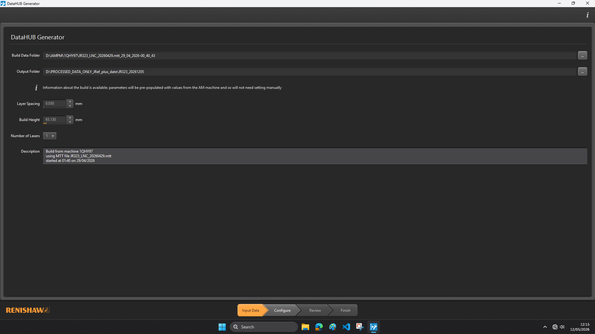
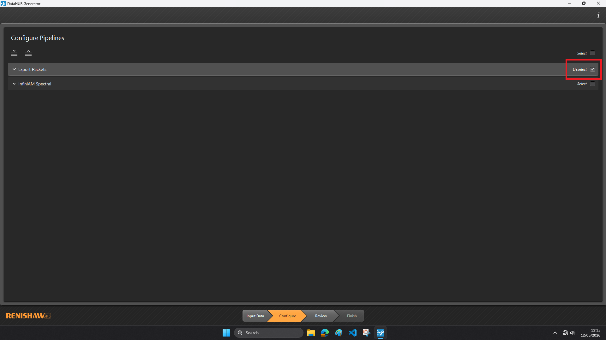
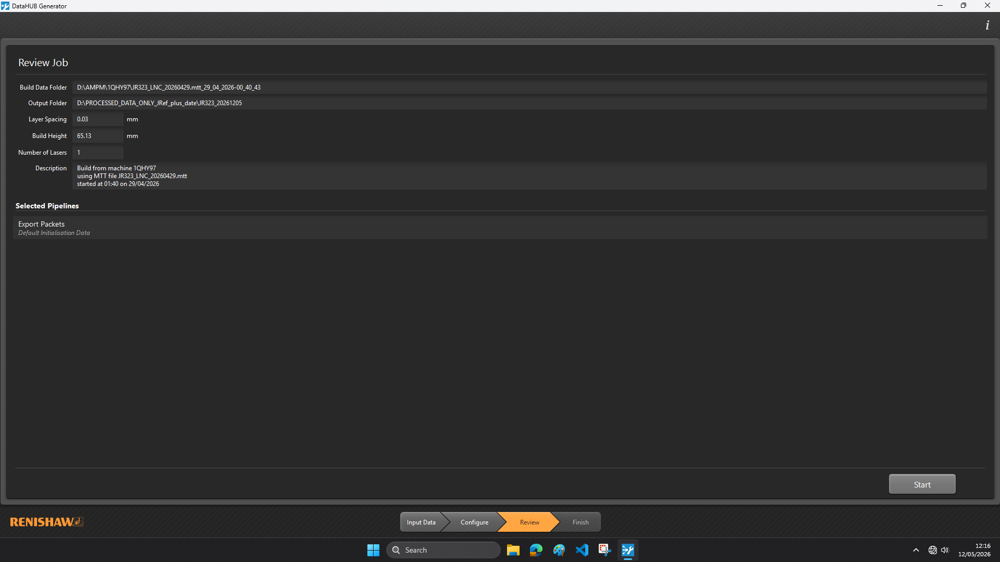
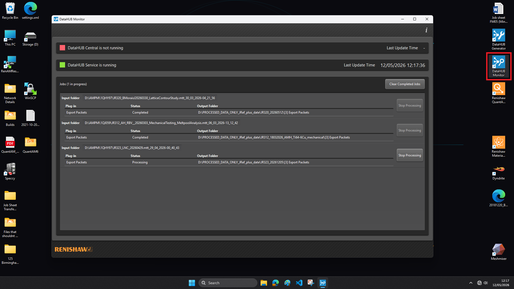
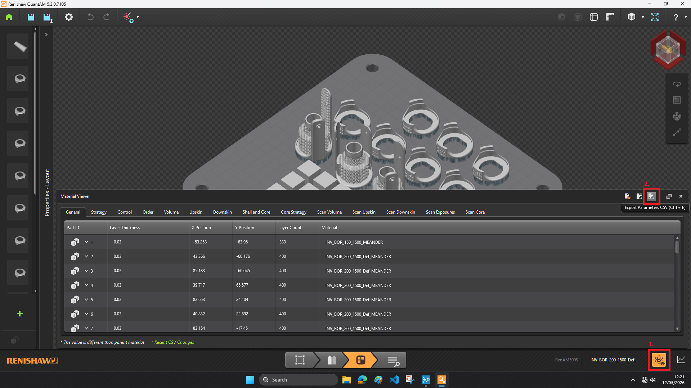
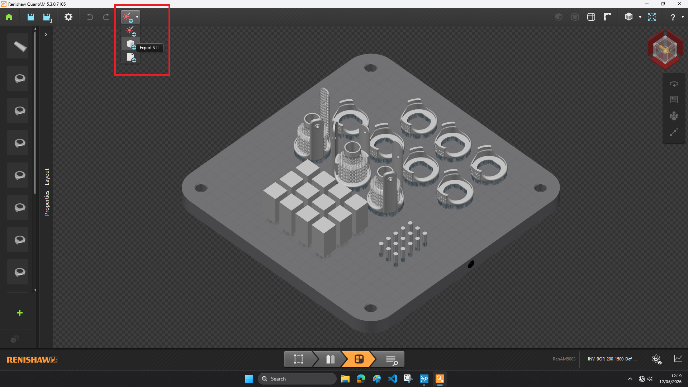

# Generating AMPM Packet Data

This guide explains how to export the AMPM build data via the DataHUB Generator. This application takes the raw data build data, `.DAT` files, and generates a `.txt` per layer of the build, referred to as "packets".

---

## 1) Launch DataHUB Generator

Launch the `DataHUB Generator` application from the desktop.

---

## 2) Select the Build Data

Click the `...` button next to **Build Data Folder** and select your build from either `D:\AMPM\1QHY97\` for the MAIN machine, or `D:\AMPM\1QJ059\` for the RBV. This should be the folder that contains the `.DAT` files.

Then, create a folder in `D:\PROCESSED_DATA_ONLY_JRef_plus_date\` with the job reference number and the date. Once created, select it as the location for the  **Output Folder**.

The other fields should populate themselves, but if they don't you can just set them manually. Note, DataHUB _requires_ a description of some kind to proceed. Click  **Configure** once set.

---

## 3) Configure and Run

Select `Export Packets` from the list and then click **Review** to continue.

Confirm all is correct then click **Start**.

## 4) DataHUB Monitor

To see the progress of your export, launch the `DataHUB Monitor` application from the desktop. This application does NOT affect data generation and can be closed without interfering with active exports.

## 5) Additional Files from QuantAM

The Python ampm-analysis pipeline requires two additional files from QuantAM to function: a **parts CSV** and a **full-plate STL**.

Open the `.amx` of your build in QuantAM, click the atom in the bottom-right corner to open the Material Viewer, then click **Export Parameters CSV**.

Finally, select **Export STL** from the top-left. This will create two STLs of the full build plate: one of all the parts' geometries and another of the supports (suffixed "_s").

---

## Notes

- Do not rename files before processing.
- The export may take a while for large builds.
- It is advised to include "fullplate", "full", or "plate" in the file name of the STL for the Python pipeline, though not required.
