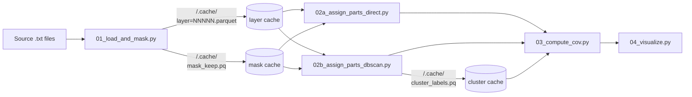

# AMPM analysis pipeline

A four-step pipeline for analyzing a Renishaw 500S AMPM build, broken into separate scripts so each step is independent and runnable on its own. Designed as a scaffold to demonstrate how each stage of `ampm-analyzer` works. Copy what you need into your own analysis scripts.

For the conceptual reference on each stage (algorithm choices, tuning tradeoffs, memory math), see [docs/PIPELINE.md](../../docs/PIPELINE.md).

## TL;DR

Place a `config.toml` in your build directory (see [config.toml](../../config.toml) for the format), then run:

```bash
python examples/pipeline/01_load_and_mask.py /path/to/build_directory
python examples/pipeline/02a_assign_parts_direct.py /path/to/build_directory  # OR 02b
python examples/pipeline/03_compute_cov.py /path/to/build_directory
python examples/pipeline/04_visualize.py /path/to/build_directory
```

The first run takes minutes (builds caches). Subsequent runs are seconds.

## Pipeline overview



Each `02*` and later script also reads the layer and mask caches (omitted from arrows above for clarity).

## Why a pipeline

The pipeline scripts split the same workflow into named phases. Each script does one job, prints what's happening, and exits.

The tradeoff: each script re-runs the upstream stages on every invocation. That looks expensive, but the cache files make all stages after 01 effectively free on subsequent runs.

## The scripts

### 01_load_and_mask.py

Reads the source `.txt` files into per-layer Parquet files, then masks rows to the part region using the STL geometry.

**Writes the following caches:**

- `<SOURCE>/.cache/layer=NNNNN.parquet`: one per source file.
- `<SOURCE>/.cache/fullplate_mask.pkl`: per-layer 2D polygons sliced from the STL.
- `<SOURCE>/.cache/mask_keep.pq`: surviving-row keys after applying the mask.

**Expected output:** Total row count loaded and row count surviving the mask. For a typical build, mask survival is 60-95% depending on how much of the build is contour scans, supports, and rapids.

### 02a_assign_parts_direct.py

Assigns each masked row to its nearest part by 2D Euclidean distance in the `(Demand X, Demand Y)` plane (no clustering).

**Caches it reads:** Layer cache + mask cache from 01.

**Key constants:**

- `MAX_DISTANCE_MM` (default `None`). Rows farther than this from every part become `noise`. Default `None` assigns every row regardless.

**When to use:** The direct assignment method works best with large parts that are well-separated. Always try direct assignment first before resorting to clustering methods.

**Expected output:** Per-part row counts and mean/max distances. Every row should be assigned and max distance should sit inside each part's bounding radius.

### 02b_assign_parts_dbscan.py

Uses chunked DBSCAN to identify clusters in the masked data, then matches each cluster to the nearest QuantAM Part ID by centroid.

**Caches it reads:** Layer cache + mask cache from 01.

**Caches it writes:** `<SOURCE>/.cache/cluster_labels.pq` - cluster ID per row.

**Key constants:**

- `EPS_XY`: in-plane neighbor radius (mm). Run `examples/tune_eps.py` to find the right value for your build.
- `EPS_Z`: through-thickness radius (mm), typically `2 * LAYER_THICKNESS`.
- `MIN_SAMPLES`: density threshold (default 10).
- `LAYERS_PER_CHUNK`: chunk size (default 11). Smaller = lower memory, more chunks.
- `OVERLAP_LAYERS`: chunk overlap (default `None` for auto). Auto picks `max(2, ceil(EPS_Z / LAYER_THICKNESS) * 2)`.

**When to use:** Use DBSCAN when direct assignment is not possible _e.g._ closely-spaced parts, lattice builds, etc.

**Warning:** If memory usage exceeds ~80% during clustering, performance may be severely throttled. Expect processing times increase from minutes to hours due to disk-based memory paging (swap thrashing).

**Expected output:** Number of clusters found, noise percentage, per-cluster summary, and the cluster to part mapping. For correct tuning, cluster count matches QuantAM part count and noise is under 1%.

### 03_compute_cov.py

Computes Coefficient of Variation (CoV) per part in three different modes (`overall`, `per_layer_mean`, `across_layers`), then joins the `overall` table with QuantAM laser parameters.

**Caches it reads:** Layer cache + mask cache from 01. Cluster cache from 02b if `USE_DIRECT_ASSIGNMENT = False`.

**Key constants:**

- `USE_DIRECT_ASSIGNMENT`: `True` mirrors 02a's logic, `False` mirrors 02b. 03 must match your choice of 02.
- `MAX_DISTANCE_MM`: used when direct assignment is on.
- DBSCAN parameters: used when direct assignment is off.
- `SIGNALS`: list of column names for which to compute CoV.

**Expected output:** Three tables of per-part CoV (one per mode), then a joined table with `Hatches Power`, `Hatch Speed`, and CoV for each part. Comparing the modes diagnoses where instability lives: high `overall` + low `per_layer_mean` means layer-to-layer drift; low `overall` + high `per_layer_mean` means within-layer noise that averages out.

### 04_visualize.py

Produces three interactive plotly figures from the part-assigned data.

**Caches it reads:** Same as 03.

**Plots produced:**

1. **3D scatter** colored by per-part overall CoV. Hover shows `part_id`, `Hatches Power`, `Hatch Speed`.
2. **KDE comparison** of the 3 most stable vs 3 least stable parts on a chosen signal.
3. **Parametric contour plot** of overall CoV vs `(Hatch Speed, Hatches Power)`. Automatically skips this plot if every part has identical laser parameters.

**Key constants:**

- Same branching and assignment constants as 03.
- `SIGNAL`: the signal column to plot (default `"MeltVIEW melt pool (mean)"`).
- `TARGET_POINTS_3D`: how many points to sample for the 3D scatter (default 80,000).

## Choosing 02a vs 02b

Choosing between direct assignment (02a) and clustering (02b) to resolve part IDs, typically depends on **how dense and how well-separated** the parts are on the build plate.

| Situation | Use |
|-----------|-----|
| Few (<20) large parts, well-separated | **02a** (direct) |
| Many small parts, lattice or DOE layout | **02b** (DBSCAN) |
| Single-part builds | **02a** |
| Parts <5 mm apart with sharp boundaries | **02b** |
| Build plate is large (200×200 mm), few parts | **02a** |

When in doubt, try 02a first. It's faster, has no tuning parameters, and produces equivalent results to DBSCAN when parts are well-separated. Switch to 02b only if you find 02a is assigning rows to the wrong parts (rare on real geometries).

Clustering methods requires parameter tuning per build. See `examples/tune_eps.py` and [docs/CLUSTERING.md](../../docs/CLUSTERING.md) for more information on DBSCAN tuning.

## What's cached and when

Three cache files live under `<SOURCE>/.cache/`:

| File | Created by | Invalidates on |
|------|-----------|----------------|
| `layer=NNNNN.parquet` (one per source file) | 01 | source file mtime |
| `fullplate_mask.pkl` | 01 | STL contents (SHA256) |
| `mask_keep.pq` | 01 | mask params (layer range, STL path, buffer) |
| `cluster_labels.pq` | 02b only | DBSCAN params (eps, min_samples, chunk size, etc.) |

If a cache mismatch is detected, the affected script raises `ValueError` rather than silently using stale data. To force a rebuild, delete the relevant `.pq` or `.pkl` file. To rebuild everything from scratch, delete `<SOURCE>/.cache/` entirely.

See [docs/CACHING.md](../../docs/CACHING.md) for the full caching model.

## Adapting the pipeline

The four scripts are deliberately simple. Once you understand the flow:

- **Copy a script into a new file** and modify it for your specific analysis. The pipeline scripts are templates, not entry points to a framework.
- **Skip steps** if you already have a part-assigned DataFrame on disk. You don't need 01 or 02; just load it and run the CoV and/or visualization parts.
- **Add more steps** between 03 and 04 _e.g._ statistical test, write to a file, comparison against historical baseline data, etc.

The end-to-end scripts in `examples/` show the same workflow in a single file, useful as a reference for what a full script looks like.
